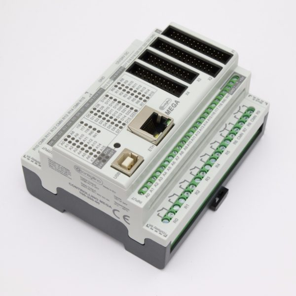

# Multichannel PID controller

Purpose of this PID controller is to lower overall amperage by cycling periodically through SSRs

This is based on [osPID](http://ospid.com/blog/download/)

### Hardware

- [Controllino - Mega (Arduino compatible)](https://www.controllino.biz/product/controllino-mega/). [See PIN layout](./vendor/controllino/CONTROLLINO-MEGA-Pinout-1.jpg)

- OLED & keypad control
- 8 channels
- Modbus
- TC sensor module, MAX6675 | MAX31855

## Features

### PID

- Autotune per PID
- Support for multiple TCs (see Marlin firmware)

### Configuration

- Set max Amp
- Set max/min heat time per cell/partition
