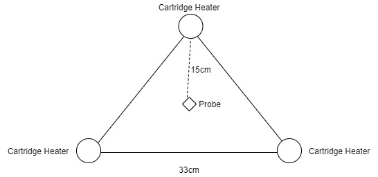

# Basic tests

We test the behaviour, times and temperature of 3 cartridge heaters on a sheetpress.

[In short, Video - Youtube](https://www.youtube.com/watch?v=2opgJ1I2T_Y&feature=youtu.be)

## Setup

- [3 Cartridge heaters](https://nl.aliexpress.com/item/32867272365.html?spm=a2g0o.productlist.0.0.564f5a002eSsCx&algo_pvid=452428f3-a649-40ee-916b-66b5fecae41a&algo_expid=452428f3-a649-40ee-916b-66b5fecae41a-3&btsid=df7c8627-0269-4d8c-90bc-8c5d3f12df73&ws_ab_test=searchweb0_0,searchweb201602_5,searchweb201603_55) at 220V
- Room temperature : 33 degc
- Stronger air circulation in the workshop
- PID : Inkbird - 100VH
- Cartridge heater : 12mm OD / 8cm L
- Extra probe to PID probe difference around 15 degc (at 220degc)
- Addtional probe to measure frame and wool temperatures
- Press Plate : [EN AW 5083 [AlMg4,5Mn0,7]](https://gleich.de/us/products/g-al-c250/), 10mm
- Insulation wol: [RockWool - ProRox WM960](https://rti.rockwool.com/en-in/products/industrial/prorox-wm-960/?selectedCat=industrial%20-%20india)

---

### Results

- PID Probe to extra probe difference : 10-25%
- Autotuning duration for 50 degC : 18 mins
- Temperature loss from heated to unheated cell (33cm) : ~30 - 50%

### Speeds

**Times to raise temperature, 220degc**

- at 130C, it took 17 secs to increase by one degc | Outer temperture (wool) : room temp
- at 140C, it took 28 secs to increase by one degc | Outer temperture : room temp
- at 155C, it took 38 secs to increase by one degc | Outer temperture : room temp | Frame-temperature : 50degc
- at 160C, it took 41 secs to increase by one degc | Outer temperture : room temp | Frame-temperature : 52degc
- at 170C, it took 52 secs to increase by one degc | Outer temperture : room temp | Frame-temperature : 53degc
- at 180C, it took 58 secs to increase by one degc | Outer temperture : room temp | Frame-temperature : 53degc
- at 190C, it took 1:54 mins to increase by one degc | Outer temperture : room temp | Frame-temperature : 53degc
- at 200C, it took 1:55 mins to increase by one degc | Outer temperture : 34 degc | Frame-temperature : 68degc
- at 210C, it took 3:02 mins to increase by one degc | Outer temperture : 35 degc | Frame-temperature : 82degc
- at 220C, it took 12:05 mins to increase by one degc | Outer temperture : 36 degc | Frame-temperature : 84degc

- after 220C, it takes **12:05 - 18 mins** to increase by one degc | Outer temperture : 36 degc | Frame-temperature : 84degc

**Total :  Time to heat from 33 degC to 210degc:  2:15 h::mm**

**Total :  Time to heat from 33 degC to 220degc:  3:28 h::mm**

---

**Times to increase temperature (turn off heating)**

- at 214degc (at the PID probe), it took 0:17 secs to cool down by 1 degc !
- at 205degc (at the extra probe - on the heater block), it took 0:21 secs to cool down by 1 degc !

---

## Conclusions

- research: we need better probes and some better logging
- build: PID probe should penetrate the heat plate
- build: Heat plate should be thicker
- build: Cartridge heater blocks should be bigger
- times: After, 200 degc (at 33 degc room temp), the system has a really hard time to increase temperature at all, especially strong wind/air circulation at the perimeter affects this times significantly
- performance: it's unlikely to go beyond 220/230 degc, especially in colder environments
- see [more](../network) remarks from the network
- serial partition heating: with a window of 18 secs to cool down one degc (heater off), we might have still a chance with better heat containment as recommended in the build remarks

